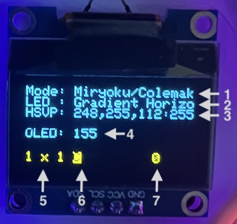

# richkbd

This is the QMK software for the richkbd. The keyboard itself is described [here](https://github.com/rvnash/richkbd).

## Hardware Feature Supported

- RP2040 Microcontroler
- RGB Matrix lighting modes for the under-key leds
- An OLED display

## The Default Keymap

### Modes

There are two distinct modes in the default keymap. One is based on the [Miryoku Layout](https://github.com/manna-harbour/miryoku) with a few customizations. This mode features home-row modifiers and tap-hold layers on the thumb row. The other layout is similar to the default keymap of the [crkbd](https://github.com/qmk/qmk_firmware/tree/master/keyboards/crkbd) keyboard. See "Switching Modes" for choosing between these modes and letter layouts.

#### Miryoku Like Mode

There are two basic letter arrangement, Colemak and QWERTY. Beyond that, moving between the layers is controlled my tap/hold key on the thumb row. The modifiers are all on tap/hold keys on the home-row. If you are not used to this way of using modifiers, it can take a bit of getting used to.

[Click here](miry.md) to see a visual representation of all of the layers.

#### Standard Mode (crkbd Like)

This is a fairly standard way of laying out 42 keys.

[Click here](std.md) to see a visual representation of all of the layers.

### Switching Modes

There are two modes and two letter layouts, making four high level modes. They are "Miry/Colemak", "Miry/QWERTY", "Std/Colemak", and "Std/QWERTY". To switch between the modes uses the "Nav Layer" from the "Miry" modes, or the "Functions" layer from the "Std" modes. The mode buttons are the second through fourth keys on the top row. The mode is persisted through reboots.

If you hit the top left key while in this layer, the keyboard will enter the Boot Loader state. If this is not desirable, press the "RESET" button to reboot the keyboard back into it's normal operatinal state.

### LED Effects

Because the RP2040 Stamp has an abundance of Flash memory, it is free to make available all of the RGB Matrix effects. You can step through them on the "Media" or "Functions" layer. The choice of effect and the HSV and Speed settings are persisted through reboots.

Layers: Whenever a special layer is invoked, like "Numbers", "Symbols", "Navigation", etc, the available key LEDs are illuminated w/ colors to assist in finding the functionality.

CAPS WORD: Whenever the CAPS WORD feature is enabled, all of the letter keys turn white.

### OLED Display Features

The OLED shows various pieces of status information about the keyboard.

1. The mode of the keyboard.
2. The current LED effect name. See [here](https://docs.qmk.fm/#/feature_rgb_matrix?id=rgb-matrix-effects) for a list.
3. The current "Hue, Saturation, Brightess: Speed" settings for the LED effect.
4. The brightness of the OLED display.
5. The coordinate of the last key pressed, in "Column x Row" order.
6. The current state of the modifiers: "C" for CTRL, "A" for ALT, "@" for GUI, "S' for SHIFT
7. The current typing speed in words-per-minute

Finally, as a fun little use of the display, there is screen saver mode that the OLED will enter after a little idle time. You can choose what image that you want to have bounce back and forth from a set in the default keymap code. The current set is listed here, but you can change or add your own up to the memory of the RP2040 Stamp flash size, which is substantial.

1. Tottenham Hotspur logo
2. Steelers logo
3. Penn State logo
4. Reily - My daughter's Newfy
5. Jade and Koda - My daughter's cats

## Bootloader

You can enter the bootloader by holding down the "BOOTSEL" button, them pressing and releasing the "RESET" button. Alternatively there are keys mapped to a bootloader reset, which are described later.

## Building and Installing

To build and install the software you will need to familiarize yourself with how to setup a QMK development environment. The documentation is excellent and you can find it all [here](https://docs.qmk.fm/#/).

Once you get that working, you will need to clone [this repository and branch](https://github.com/rvnash/qmk_firmware/tree/rvnash_rp2040).

You can compile and flash the default layout for this keyboard with this command.

    qmk flash -kb rvnash/richkbd -km default

Reach out with any questions, and good luck, and enjoy!
